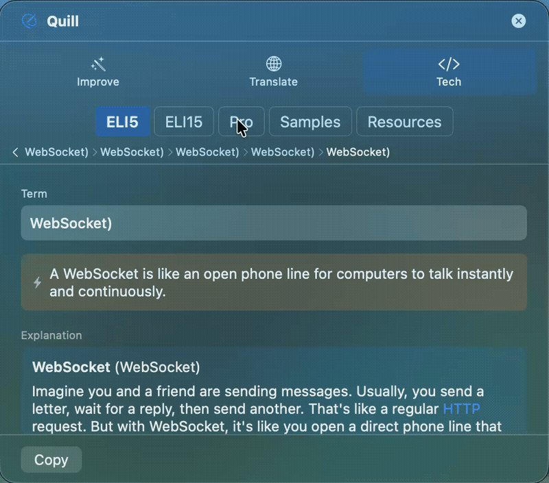
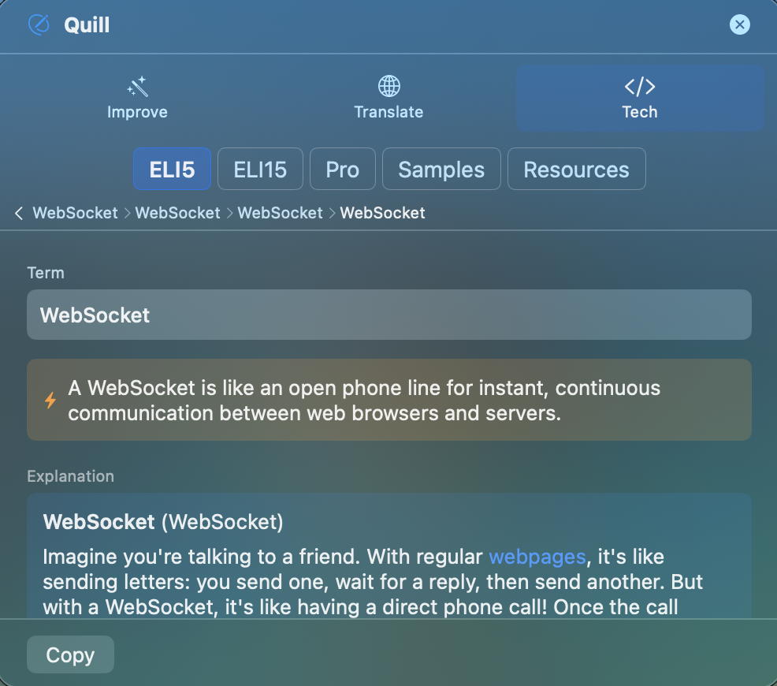
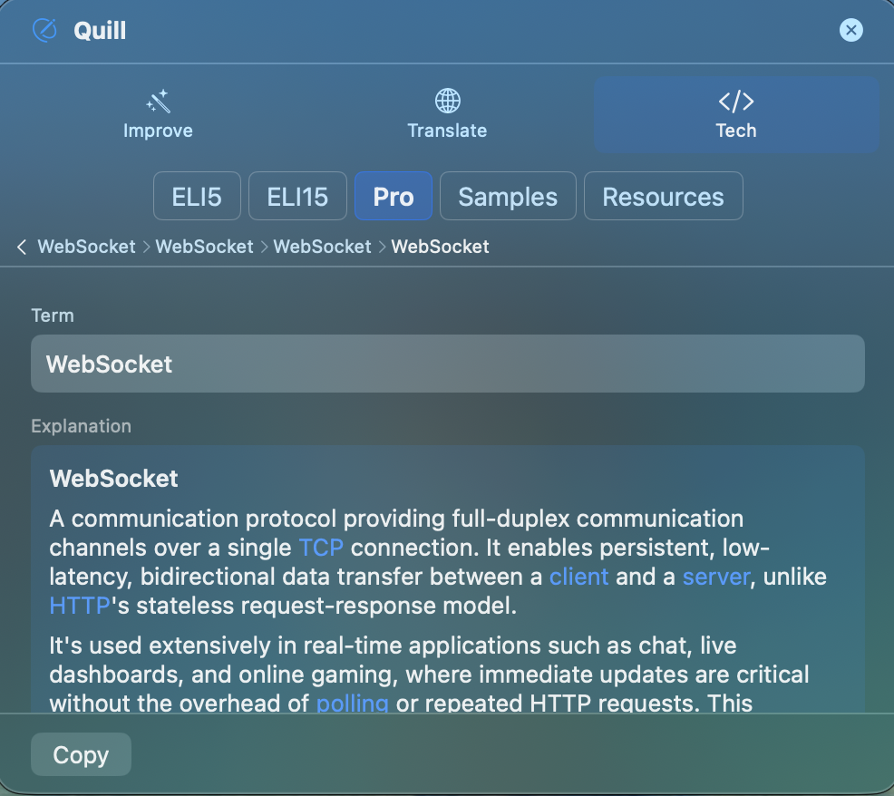
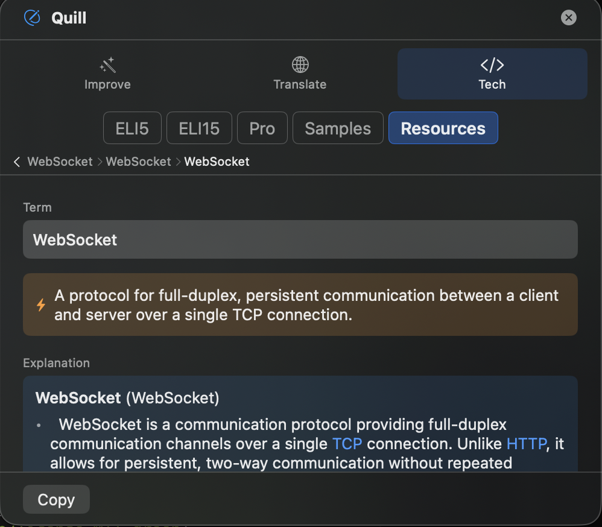
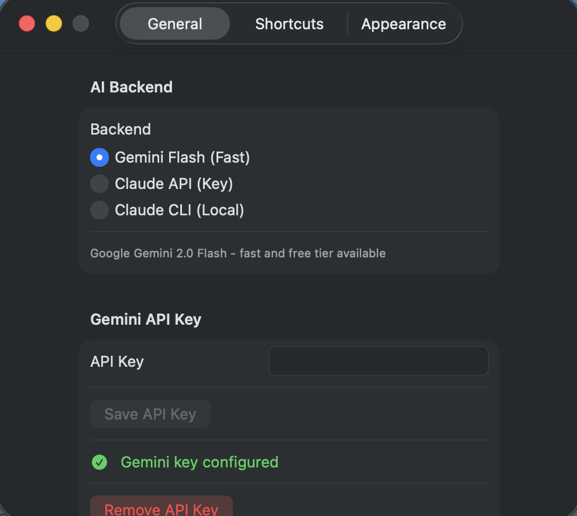

# Quill

**Learn what AI writes for you.**

A system-wide tech dictionary for macOS. When AI generates code with terms you don't know, select the term in any app, press a shortcut, and get an instant explanation — in your language, at your level.

  

<p align="center">
  
</p>

## The Problem

AI writes code for you. It uses `WebSocket`, sets up a `Docker` container, configures `nginx` reverse proxy. You nod along, but — *what does half of this actually mean?*

Googling breaks your flow. Asking the AI opens a new thread. You just want a quick, clear answer *right where you are*.

## The Solution

1. **Select** a term in any app — terminal, IDE, browser, anywhere
2. **Press** `⌃⌥Q`
3. **Learn** — instant explanation appears in a floating panel
4. **Drill down** — click any highlighted term to go deeper, like a Wikipedia rabbit hole for tech

No context switching. No new tabs. No copy-paste into ChatGPT.

## Key Features

### Multi-Level Explanations

Pick the depth that fits you:

| Level | For whom |
|-------|----------|
| **ELI5** | Total beginners — simple words, fun analogies |
| **ELI15** | Learning to code — clear language, some technical terms |
| **Pro** | Experienced devs — trade-offs, patterns, edge cases |
| **Samples** | Code examples — 2-3 practical, runnable snippets |
| **Resources** | Learning path — what to study next, common pitfalls |
| **Alts** | Alternatives & competitors — pros/cons comparison |

<p align="center">
  
  
</p>

### Drill-Down Navigation

Explanations highlight related terms in `[[brackets]]`. Click one to go deeper. A breadcrumb trail lets you navigate back. You can also **select any text** in the explanation and press the hotkey to explore it — no brackets needed.

<p align="center">
  
</p>

### Persistent TL;DR + Resources

Every explanation comes with:
- A **one-line TL;DR** pinned above the tabs — always visible when switching levels
- **Resource links** to official docs, tutorials, and references

### Also Included

- **Improve mode** — grammar, spelling, punctuation fixes with inline diff
- **Translate mode** — auto-detect and translate between languages
- **Vocabulary cards** — learn richer word alternatives with CEFR levels

## Why Quill?

| | Google it | Ask ChatGPT | Quill |
|---|-----------|-------------|-------|
| **Speed** | Open browser, type, scroll | New thread, wait | Select → hotkey → done |
| **Context switch** | Full | Partial | None |
| **Your language** | Maybe | If you ask | Always |
| **Your level** | One size fits all | Depends on prompt | ELI5 to Pro, one click |
| **Drill down** | Open 5 tabs | Ask follow-ups | Click the term |
| **Works in** | Browser only | Browser only | Any app, system-wide |

## Installation

### Requirements

- macOS 14 (Sonoma) or later
- An API key for [Google Gemini](https://aistudio.google.com/apikey) (free tier available) or [Anthropic Claude](https://console.anthropic.com/settings/keys)

### Download

**[Download Quill-1.0.0.dmg](https://github.com/uptakeagency/quill/releases/latest)** — Open the DMG, drag to Applications, done.

> Since Quill is not notarized, macOS may show a security warning. Right-click → Open to bypass it.

### Build from Source

```bash
git clone https://github.com/uptakeagency/quill.git
cd quill
./scripts/build-app.sh release
open dist/Quill.app
```

### First Launch

1. **Grant Accessibility permission** — System Settings > Privacy & Security > Accessibility
2. **Add your API key** — Open Settings from the menu bar icon
   <p></p>
3. **Select a term, press `⌃⌥Q`** — that's it

## How It Works

```
You select "WebSocket" in VS Code
        ↓
  ⌃⌥Q (hotkey)
        ↓
  Quill reads selection via Accessibility API
        ↓
  AI explains it at your chosen level
        ↓
  Floating panel appears near cursor
        ↓
  You see: TL;DR → Explanation → Resources → Alternatives
        ↓
  Click [[HTTP]] in the explanation or an alternative → drill deeper
        ↓
  Breadcrumb: WebSocket > HTTP (navigate back anytime)
```

## Architecture

Hexagonal (Ports & Adapters) with clean separation:

```
Quill/
├── Domain/
│   ├── Models/           # ExplanationLevel, TechDictionaryState, AnalysisResult
│   └── Ports/            # AIServiceProtocol
├── Infrastructure/
│   ├── Claude/           # Claude API + CLI, prompts, response parser
│   ├── Gemini/           # Gemini API (default backend)
│   ├── Accessibility/    # AXUIElement text capture & replacement
│   └── Keychain/         # Secure API key storage
├── Presentation/
│   ├── FloatingPanel/    # Panel, suggestions, markdown renderer, drill-down
│   ├── Settings/         # Configuration UI
│   └── MenuBar/          # Menu bar icon
└── App/                  # AppState, lifecycle
```

### Technical Highlights

- **System-wide** via Accessibility API (non-sandboxed)
- **NSPanel** with `.nonActivatingPanel` — doesn't steal focus from source app
- **Prompt caching** — Claude API `cache_control` for token savings
- **Disk cache** — explanations persist across sessions (UserDefaults)
- **Multi-layer JSON parser** — Codable → sanitize → JSONSerialization → regex fallback
- **Protocol-based AI backends** — swap between Gemini, Claude API, Claude CLI

## Dependencies

| Package | Version | Purpose |
|---------|---------|---------|
| [KeyboardShortcuts](https://github.com/sindresorhus/KeyboardShortcuts) | 1.9.4 | Global hotkey |
| [KeychainAccess](https://github.com/kishikawakatsumi/KeychainAccess) | 4.2.2+ | Secure API key storage |
| [SwiftAnthropic](https://github.com/jamesrochabrun/SwiftAnthropic) | 2.0.0+ | Claude API client |

## Building

```bash
swift build                    # Development build
./scripts/build-app.sh debug   # Debug .app bundle
./scripts/build-app.sh release # Release .app bundle
./scripts/create-dmg.sh        # DMG for distribution
```

No Xcode required. For Xcode project: `xcodegen generate`.

## License

MIT
